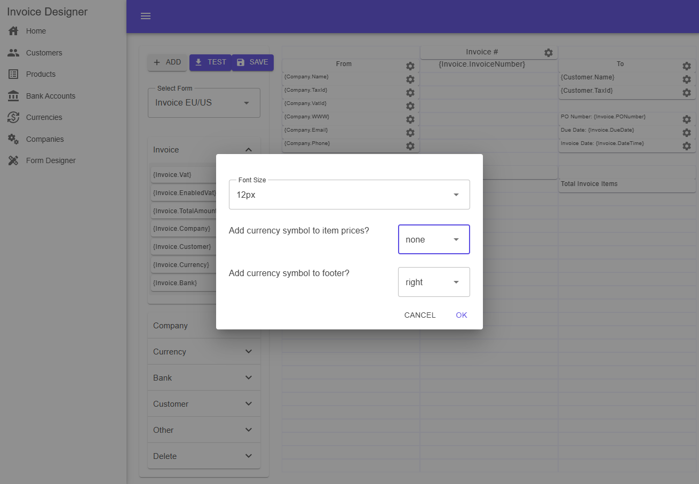
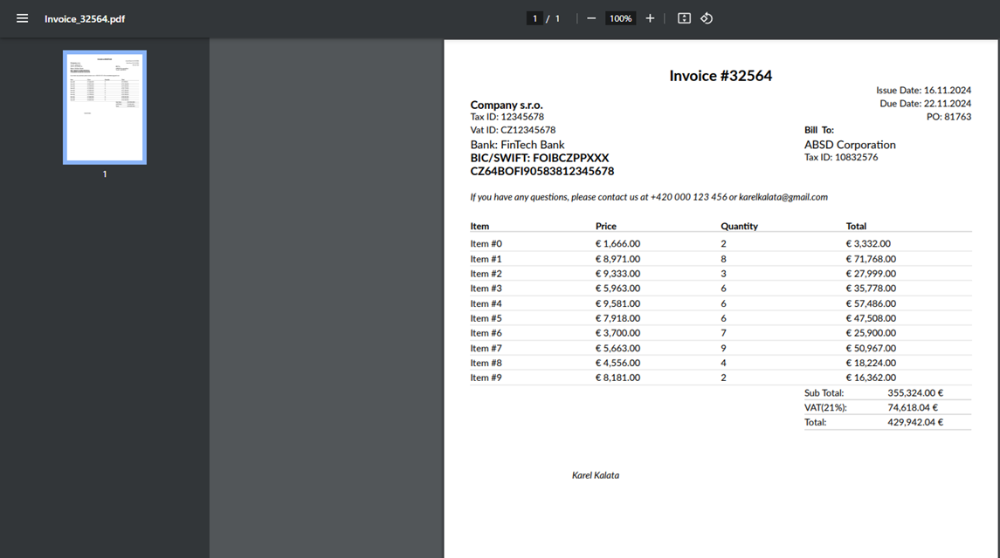
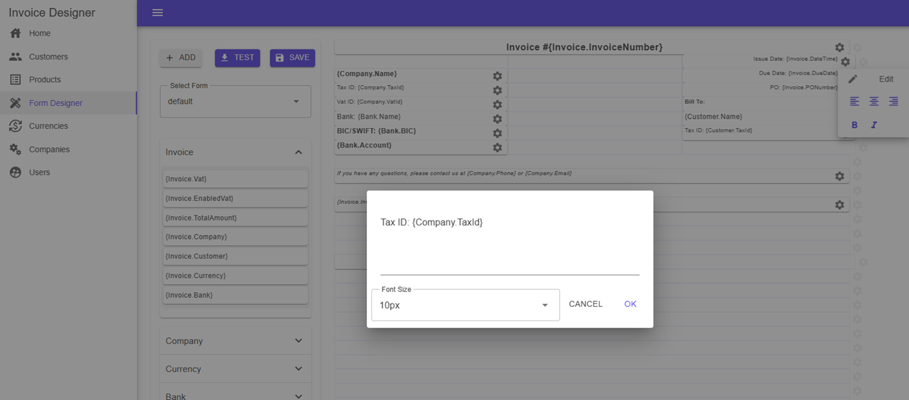

# InvoiceDesigner
With InvoiceDesigner, customizing your invoice print form is super easy. You can add, move around, and tweak elements in the layout, all without touching any code. Want to include extra info or some custom fields? No problem! 

## Technical Features
 - No JavaScript/TypeScript/React/Angular/Vuejs and other frontend framework
 - No npm dependencies
 - C#
 - MudBlazor UI
 
## Screenshots
<p align="center">
  
</p>
<p align="center">
  
</p>
<p align="center">
  
</p>

## Features
No hosting required - works locally/lan
Customizable PDF invoice
Manage your Clients
Invoice Management
Customer Management

## Development Environment
- Microsoft Visual Studio 2022 Community Edition (https://visualstudio.microsoft.com/vs/community/)
- Sqlite
- Nuget Package
  - Microsoft.EntityFrameworkCore
  - Microsoft.EntityFrameworkCore.Sqlite
  - Microsoft.EntityFrameworkCore.Design
  - AutoMapper
  - QuestPDF

## Config WebApp
Base Url REST API
**InvoiceDesigner\InvoiceDesigner.WebApp\appsettings.json**

```json
  "ApiSettings": {
    "BaseUrl": "https://localhost:7048/"
  }
``` 

## Author
- [Karel Kalata][link-author]

## License
InvoiceDesigner is licensed under the MIT license, an open-source software license.