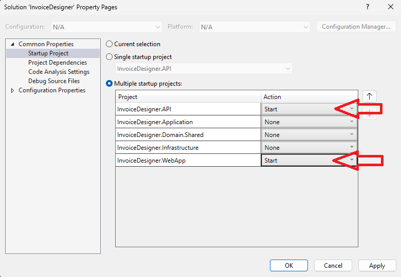

# InvoiceDesigner
InvoiceDesigner is a **C# and MudBlazor**-based tool designed to make invoice customization easy, with **no JavaScript/TypeScript/React/Angular/Vuejs and other frontend framework** involved. You can create and personalize invoice print forms in PDF using a drag-and-drop interface.

## Technical Features
 - No JavaScript/TypeScript/React/Angular/Vuejs and other frontend framework
 - No npm dependencies
 - C#
 - MudBlazor UI
 
## Screenshots
<p align="center">
  
</p>
<p align="center">
  
</p>
<p align="center">
  
</p>

## Features
- **Local/LAN Support:** Work offline or on a local network.
- **Customizable PDF Invoices:** Tailor designs with ease using drag-and-drop.
- **Client & Customer Management:** Organize all your contacts efficiently.
- **Invoice Management:** Create, track, and manage invoices seamlessly.
- **User Access Control:** Secure data with role-based access for companies.
- **Built-In Authorization:** Authenticate users via a robust JWT-based system.

## Development Environment
- [Microsoft Visual Studio 2022 Community Edition](https://visualstudio.microsoft.com/vs/community/)
- [QuestPDF](https://github.com/QuestPDF/QuestPDF)

## Config
### Change SecretKey!
**InvoiceDesigner\InvoiceDesigner.API\appsettings.json**
```json
  "JWTOption": {
    "SecretKey": "b3£O(27z4e=p^JRf(-&vm]k5f7$WRjpcAz{N&S", // Change this!
    "ExpiresHours": 8
  }
```

### Base Url REST API
**InvoiceDesigner\InvoiceDesigner.WebApp\appsettings.json**

```json
  "ApiSettings": {
    "BaseUrl": "https://localhost:7048/"
  }
``` 
## Launching
- create migration
```bash
dotnet ef migrations add AddInitialMigration --startup-project InvoiceDesigner.API --project InvoiceDesigner.Infrastructure
``` 
- update database   
```bash
dotnet ef database update --project InvoiceDesigner.Infrastructure --startup-project InvoiceDesigner.Api

``` 
Set multiple startup projects 

<p align="center">
  
</p>

- default login
  - user: admin
  - pass: admin

## Author
[Karel Kalata](https://github.com/karelkalata)


## License
InvoiceDesigner is licensed under the MIT license, an open-source software license.
Please read the license [QuestPDF](https://github.com/QuestPDF/QuestPDF/blob/main/LICENSE.md)