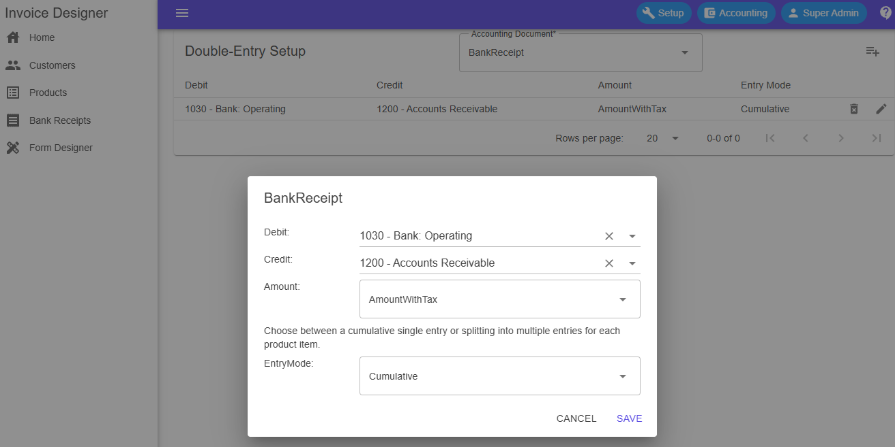

# InvoiceDesigner
With InvoiceDesigner, customizing your invoice print form is super easy. You can add, move around, and tweak elements in the layout, all without touching any code. Want to include extra info or some custom fields? No problem! 

## Technical Features
- No JavaScript/TypeScript/React/Angular/Vuejs and other frontend framework
- Completely free of npm dependencies
- Built with the power and simplicity of C#
- Enhanced UI/UX powered by [MudBlazor](https://github.com/MudBlazor/MudBlazor)
 
## Features
- Works Locally/Lan/Internet
- Fully customizable PDF invoices
- Comprehensive Invoice Management
- Client and Product Management
- Multi-currency pricing support for products
- Multi-company support with unlimited banks, each supporting different currencies per company
- Advanced user access control for managing permissions across companies
- Detailed User Activity Logging (creation, editing, archiving, etc.)
- Localization: English, Čeština, Deutsch, España, Français, Italiano, Polski, Português, Русский

## Screenshots
<p align="center">
  
</p>
<p align="center">
  
</p>
<p align="center">
  
</p>
<p align="center">
  
</p>


## Development Environment
- [Microsoft Visual Studio 2022 Community Edition](https://visualstudio.microsoft.com/vs/community/)
- [QuestPDF](https://github.com/QuestPDF/QuestPDF)

## Config
### Change SecretKey!
**InvoiceDesigner\InvoiceDesigner.API\appsettings.json**
```json
  "JWTOption": {
    "SecretKey": "b3£O(27z4e=p^JRf(-&vm]k5f7$WRjpcAz{N&S", // Change this!
    "ExpiresHours": 8
  }
```

### Base Url REST API
**InvoiceDesigner\InvoiceDesigner.WebApp\appsettings.json**

```json
  "ApiSettings": {
    "BaseUrl": "https://localhost:7048/"
  }
``` 
## Launching
- create migration
```bash
dotnet ef migrations add AddInitialMigration --startup-project InvoiceDesigner.API --project InvoiceDesigner.Infrastructure
``` 
- update database   
```bash
dotnet ef database update --project InvoiceDesigner.Infrastructure --startup-project InvoiceDesigner.Api

``` 
Set multiple startup projects 

<p align="center">
  
</p>

- default login
  - user: admin
  - pass: admin

## Author
[Karel Kalata](https://github.com/karelkalata)


## License
InvoiceDesigner is licensed under the MIT license, an open-source software license.
Please read the license [QuestPDF](https://github.com/QuestPDF/QuestPDF/blob/main/LICENSE.md)